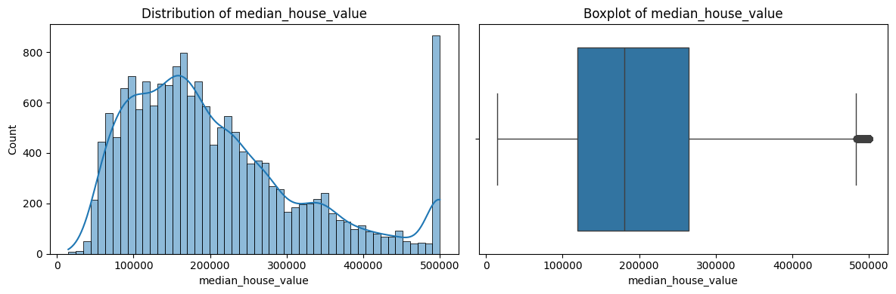
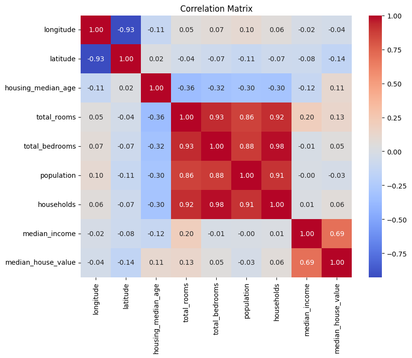
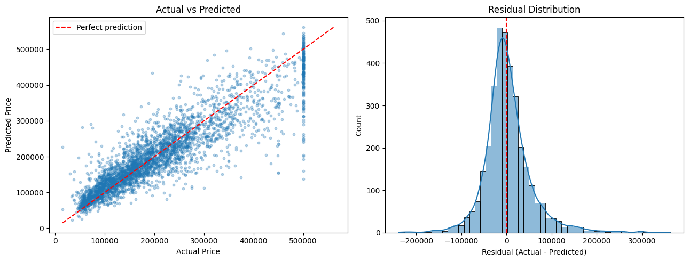
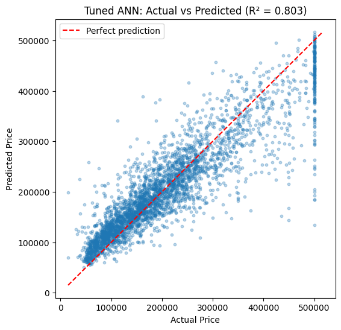
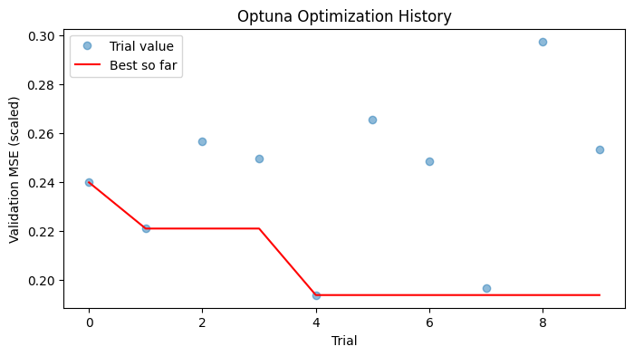
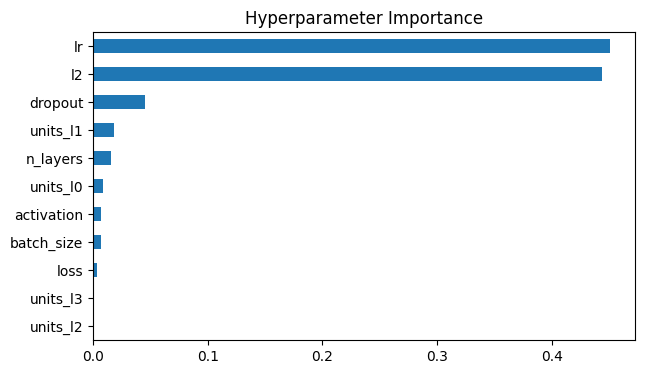

# 🏠 House Price Prediction using ANN + Optuna

A regression project that predicts **median house value** on the California Housing dataset using an **Artificial Neural Network (TensorFlow/Keras)**, with **feature engineering** and **hyperparameter tuning using Optuna**. The notebook runs end to end: EDA → preprocessing → training → evaluation → tuning → saving → inference.

---

## 📊 Results (Test Set, 3,400 samples)

| Metric | Baseline ANN | Tuned ANN (Optuna) | Change |
|---|---|---|---|
| **R²** | 0.7979 | **0.8028** | +0.0050 |
| **RMSE** | $52,667 | **$52,016** | −$651 |
| **MAE** | $35,933 | $35,974 | +$41 |

- R² ≈ 0.80 → the model explains about **80%** of the variation in house prices.
- Average house price in the data is ~$207k → MAE is about 17% and RMSE about 25% of it.
- Tuning gave a **small gain** (10 Optuna trials). The dataset itself limits accuracy: prices are capped at $500,001 and there are no neighbourhood-quality features.

> MAE and RMSE are in **dollars** (same unit as the target), MSE is in dollars². Only R² is on a fixed ~0–1 scale.

---

## 🧠 Approach

1. **EDA** – shape, nulls, duplicates, distributions, correlation heatmap
2. **Split** – 80/20 train-test **before** scaling (no data leakage)
3. **Scaling** – `StandardScaler` for features **and** target (fit on train only); predictions are inverse-transformed back to $
4. **Baseline ANN** – `64 → 32 → 16 → 1` (ReLU, Adam, MSE) with validation split + EarlyStopping
5. **Feature engineering** – `rooms_per_household`, `bedrooms_per_room`, `population_per_household`
6. **Optuna tuning** – layers, units, activation, dropout, L2, learning rate, batch size, loss (MSE vs Huber); tuned on a validation split of the train set only
7. **Final model** – retrained with best params, evaluated once on the test set
8. **Saved artifacts** – model, scalers, best params, plus a reusable `predict_house_price_tuned()` function

**Best Optuna parameters:** 2 hidden layers (64, 256), ReLU, dropout 0.2, L2 ≈ 3.5e-5, learning rate ≈ 9.9e-4, batch size 128, MSE loss.
Learning rate and L2 were the most important hyperparameters.

---

## 🖼️ Plots

| Target distribution | Correlation heatmap |
|---|---|
|  |  |

| Baseline: actual vs predicted | Tuned: actual vs predicted |
|---|---|
|  |  |

| Optuna history | Hyperparameter importance |
|---|---|
|  |  |

---

## 📁 Repository Structure

```
house-price-prediction-ann/
├── House_Price_Prediction_ANN_Optuna.ipynb   # Main end-to-end notebook
├── data/
│   └── california_housing_train.csv          # Dataset (17,000 rows × 9 columns)
├── artifacts/
│   ├── house_price_ann.keras                 # Baseline model
│   ├── house_price_ann_tuned.keras           # Tuned model
│   ├── feature_scaler.joblib                 # Scaler for the 8 original features
│   ├── feature_scaler_tuned.joblib           # Scaler for the 11 engineered features
│   ├── target_scaler.joblib                  # Target scaler (used by both models)
│   ├── feature_columns.joblib                # Original feature order
│   └── best_params.json                      # Best Optuna hyperparameters
├── images/                                   # Plots used in this README
├── requirements.txt
├── .gitignore
└── README.md
```

---

## ▶️ How to Run

**Locally**
```bash
git clone https://github.com/gayatri-vidhate-3/house-price-prediction-ann.git
cd house-price-prediction-ann

python -m venv venv
venv\Scripts\activate          # Windows   (Mac/Linux: source venv/bin/activate)
pip install -r requirements.txt

jupyter notebook House_Price_Prediction_ANN_Optuna.ipynb
```
Run the notebook from the repo root so `data/` and `artifacts/` paths resolve.

**Google Colab** – upload the notebook; the dataset is already at `/content/sample_data/california_housing_train.csv`. Run `!pip install optuna` first.

---

## 🔮 Quick Inference (saved model)

```python
import joblib, pandas as pd
from tensorflow.keras.models import load_model

model    = load_model("artifacts/house_price_ann_tuned.keras")
scaler   = joblib.load("artifacts/feature_scaler_tuned.joblib")
y_scaler = joblib.load("artifacts/target_scaler.joblib")

house = {"longitude": -118.30, "latitude": 34.05, "housing_median_age": 25.0,
         "total_rooms": 2500.0, "total_bedrooms": 500.0, "population": 1400.0,
         "households": 480.0, "median_income": 4.5}

df = pd.DataFrame([house])
df["rooms_per_household"]      = df["total_rooms"] / df["households"]
df["bedrooms_per_room"]        = df["total_bedrooms"] / df["total_rooms"]
df["population_per_household"] = df["population"] / df["households"]

pred = model.predict(scaler.transform(df), verbose=0)
print(f"Predicted price: ${y_scaler.inverse_transform(pred)[0][0]:,.0f}")
```

---

## ⚠️ Limitations
- Target is capped at $500,001 → the model cannot predict above it and errors rise for expensive houses.
- Data is from the 1990 census and block-group level; no property-level features (size, condition, amenities).
- Only 10 Optuna trials were run; results vary slightly between runs (neural-network randomness).

## 🚀 Future Improvements
- More Optuna trials / KerasTuner comparison
- Log-transform the target and handle the price cap
- Compare with Linear Regression, Random Forest, XGBoost / LightGBM
- Wrap the model in a FastAPI / Streamlit app

## 🛠️ Tech Stack
Python · TensorFlow/Keras · scikit-learn · Optuna · pandas · NumPy · Matplotlib · Seaborn

## 👤 Author
**Gayatri Vidhate**

Data Scientist | Machine Learning Engineer | NLP Engineer | GenAI Engineer

If you found this useful, feel free to ⭐ the repo or connect with me!
